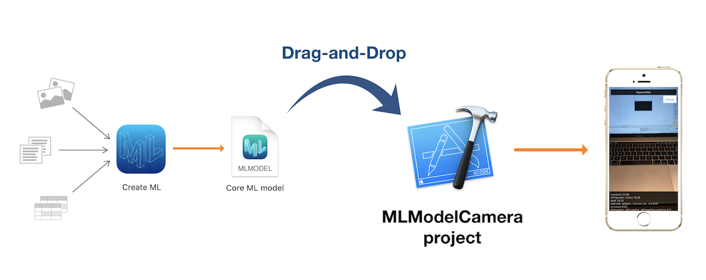

# FaceMaskDetect

[Create ML](https://developer.apple.com/documentation/create_ml) enable us to train [Core ML](https://developer.apple.com/documentation/coreml) models just with Drag-and-Drop. Then, `MLModelCamera` enable to test the `.mlmodel` files as a real-time `Image Classiffication` or `Object Detection` app just with Drag-and-Drop.

## Usage

- Put your `.mlmodel` files into the `/models` folder.

That's it! You don't need to add the models manually to the project.

After running the app on your iOS device, you can choose the model with the "Change" button.

## Supporting Model Types

- Image Classification
- Object Detection

## Requirements

### The models are created with Create ML

- Xcode 10+
- iOS 12+

### The models are created with coremltools

- Xcode 9+
- iOS 11+

## How to find trained models

todo

## How to find data for training

todo

## Author

**[Jayce Zhang]()**

iOS programmer from Japan.

